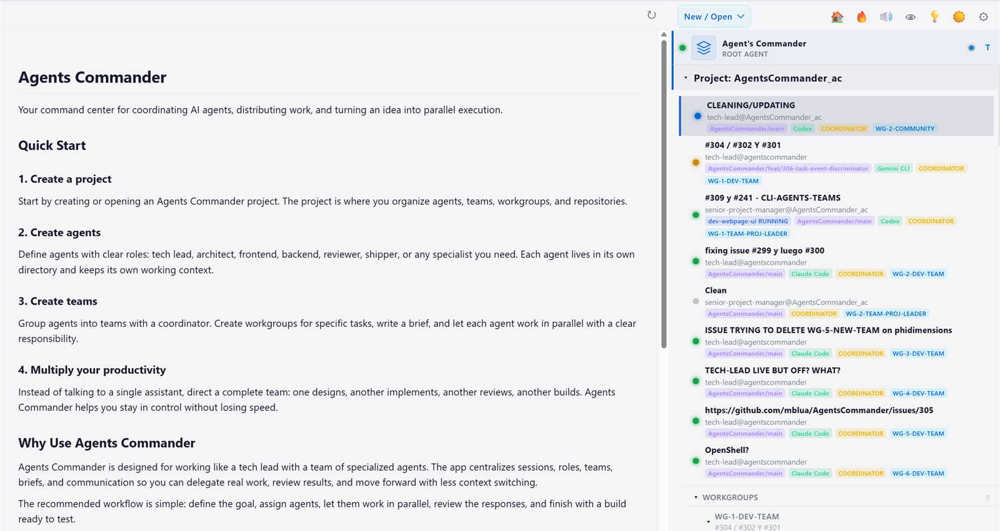

  

<h1 align="center">Agents Commander</h1>

  Run multiple teams of AI coding agents (Claude Code, Codex, Gemini) across separate workgroup instances. 
  Root Agent coordination, visible terminals, and file-based workflows you can inspect.

  
  
  
  
  
  

  <a href="https://github.com/mblua/AgentsCommander/releases/latest"><b>⬇ Download (latest release)</b></a>
  &nbsp;·&nbsp;
  <a href="#60-second-quickstart"><b>▶ 60-second quickstart</b></a>
  &nbsp;·&nbsp;
  <a href="docs/quickstart.md"><b>Quickstart</b></a>

---

## The 30-second pitch

- **Pick the coding agent per role.** Claude Code on architecture, Codex on dev, Gemini on review, or any mix. Each runs in its own real terminal with a full PTY, not a command runner.
- **Direct multiple workgroups from the Root Agent.** The Agent Commander / Root Agent gives you one place to steer work across teams. Ask it to talk to workgroup coordinators, send work to different teams, and keep initiatives aligned across parallel workgroups.
- **Multi-agent Teams that coordinate through files.** Agents exchange markdown messages in a `messaging/` folder you can `cat`, `git diff`, and audit. The whole org fits in `ls`.
- **Phone-ready updates with images.** The Telegram bridge can stream session output and send photos or screenshots captured by agents, so remote status can include the actual screen or report.
- **Local state, no telemetry.** All state lives in plain JSON, TOML, and markdown next to the binary. Portable: copy the `.exe` to any drive and it carries its own config.

You bring the coding agents. AgentsCommander coordinates them.

## See it work

  

## 60-second quickstart

1. **Download** the latest installer for your platform from [the releases page](https://github.com/mblua/AgentsCommander/releases/latest). Windows `.exe`, Linux `.AppImage`, and macOS `.dmg` are built on every release.
2. **Run** the installer (or run the portable `.exe` directly; see [Portable instances](docs/features/portable-instances.md)).
3. **Open a project**: click `New Project` in the sidebar and point it at an empty folder. AC creates a Project AC Root (`.ac/`) there.
4. **Create a Team**: add a coordinator and one worker agent, each with a role prompt. [Teams and workgroups](docs/agents/teams-and-workgroups.md) walks through this.
5. **Launch the coordinator**: pick Claude Code, Codex, or Gemini from the dropdown. Ask it to send the worker a hello message. The worker terminal receives a file notification and responds in real time.

Full walkthrough: [`docs/quickstart.md`](docs/quickstart.md).

## Why this exists

Most agent tools focus on in-process orchestration or one interactive session. AgentsCommander starts with the **coding agents you already use** (Claude Code, Codex, Gemini), runs them as real OS processes, and lets them coordinate through plain markdown files that any human, any tool, and any `git diff` can inspect. You see every step in a real terminal, and the coordination state stays visible on disk.

## What you can build

| Use case | Setup |
|---|---|
| **Parallel feature development** | Two coding agents on the same repo, each owning a different module. Coordinator routes work and merges results. |
| **Code-review swarm** | One agent ships a PR; two others review independently. You read both reviews in their own terminals before merging. |
| **Autonomous refactor crew** | A long-running coordinator splits a multi-file refactor across worker agents and rebases their branches as they finish. |
| **Long-running agent with phone alerts** | Pair a session with a [Telegram bot](docs/features/telegram-bridge.md), kick off a build from your phone, and receive text updates plus screenshots or image artifacts. |

Full recipes: [`docs/use-cases.md`](docs/use-cases.md).

## How it compares

| | AgentsCommander | LangGraph | AutoGen / AG2 | CrewAI | Aider | Claude Code alone |
|---|---|---|---|---|---|---|
| **Operates real CLI coding agents** | ✅ Claude Code, Codex, Gemini | ❌ Python LLM calls | ❌ Python conversation | ❌ Python library | Partial (one agent) | ✅ (one agent) |
| **Real PTY per agent** | ✅ ConPTY / Unix PTY | ❌ | ❌ | ❌ | ✅ | ✅ |
| **Filesystem-first messaging** | ✅ Markdown in `messaging/` | ❌ DB / Python state | ❌ Python objects | ❌ Python tasks | n/a | n/a |
| **Standalone runtime** | ✅ Rust / Tauri | ❌ Python library | ❌ Python library | ❌ Python library | ❌ Python app | ✅ standalone CLI |
| **Multi-agent on the same repo** | ✅ | Partial | Partial | Partial | ❌ | ❌ |
| **Desktop UI** | ✅ Tauri app | ❌ | ❌ | ❌ | TUI only | TUI only |

Full comparison with trade-offs and honest losses: [`docs/comparison.md`](docs/comparison.md).

## Design principles

These are not accidents.

- **Start with files and CLIs.** AgentsCommander keeps the core workflow in plain files and real terminal sessions. External protocols, including MCP, belong where they improve a concrete integration without hiding the workflow.
- **Files before databases.** All state and communication is persisted to plain files (JSON, TOML, markdown). Every change is visible via `git diff`, trivial to inspect, easy to debug. Databases can be introduced later for performance-critical paths once the data model is mature.
- **One agent = one directory.** An agent is defined by a `CLAUDE.md` file (or equivalent role-prompt file) inside its own directory. Multiple role prompts within the same directory or its subdirectories are forbidden. Coding agents assume the entire contents of their working directory are relevant context; if two role prompts coexisted, an agent could read another agent's role and leak context.

## Documentation

- [Quickstart](docs/quickstart.md): 60-second download to first running agent
- [Concepts](docs/concepts.md): agent, team, workgroup, coordinator, brief
- [Teams and workgroups](docs/agents/teams-and-workgroups.md): coordinators, members, briefs, messaging
- [Features](docs/features/): Telegram bridge with image and screenshot sends, voice-to-text, portable instances, RTK integration
- [Reference](docs/reference/): full CLI, `settings.json` schema, architecture, log filtering
- [Roadmap](ROADMAP.md) · [Changelog](CHANGELOG.md) · [Docs style guide](docs/style-guide.md)

## Platform support

| Platform | Status |
|---|---|
| **Windows** | Primary version where most development happens. |
| **Linux** | Testing is beginning. |
| **macOS** | Untested. |

## Trust

AgentsCommander does not collect telemetry, analytics, or usage data. Optional features (Telegram Bridge, Voice-to-Text) transmit data to external services only when you enable them; see [`PRIVACY.md`](PRIVACY.md). Windows releases are digitally signed: certificate by [SignPath Foundation](https://signpath.org), free code signing courtesy of [SignPath.io](https://signpath.io). Full policy in [`CODE_SIGNING_POLICY.md`](CODE_SIGNING_POLICY.md).

## Community

- **Questions, ideas, show-and-tell**: [GitHub Discussions](https://github.com/mblua/AgentsCommander/discussions).
- **Bug reports, feature requests**: [GitHub Issues](https://github.com/mblua/AgentsCommander/issues).
- **What's next**: [`ROADMAP.md`](ROADMAP.md). Pinned issues track macOS verification and the coding agents we want to add next.

## Contributing

See [`CONTRIBUTING.md`](CONTRIBUTING.md): branch naming, local build, log-filter setup, and the docs style guide.

## Acknowledgments

AgentsCommander stands on the shoulders of:

- **[@msitarzewski/agency-agents](https://github.com/msitarzewski/agency-agents)**: community library of agent role templates. AC ships a vendored snapshot of this catalog (see `src-tauri/src/commands/agency_agents_snapshot.json`) so role browsing works offline. Big thanks to the maintainers for keeping it open.
- **[RTK (Rust Token Killer)](https://github.com/rtk-ai/rtk)**: CLI proxy that compresses command outputs to cut LLM token consumption by 60–90% on common dev operations. AC auto-detects `rtk` on PATH at startup and wires the `PreToolUse` hook into managed agent directories (see `src-tauri/src/lib.rs:382-473` and `src-tauri/src/config/claude_settings.rs`).

Also: Tauri, SolidJS, xterm.js, portable-pty, axum, tokio; the toolchain layer this app would be impossible without.

## Author

Mariano is passionate about software development, AI, and blockchain. He approaches the world with deep curiosity, always amazed by life and the universe. Above all, he is a father, which remains the most wonderful part of his life.

**Mariano Blua**: [GitHub](https://github.com/mblua) · [LinkedIn](https://www.linkedin.com/in/mariano-blua/) · [🇦🇷 MarianoBlua](https://x.com/MarianoBlua) · [🇺🇸 MarianoBluaEN (English)](https://x.com/MarianoBluaEN)

## License

[MIT](LICENSE)
