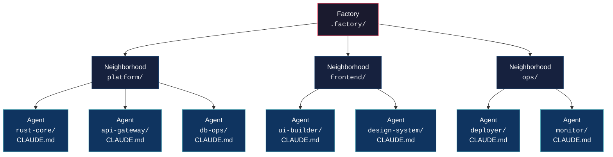
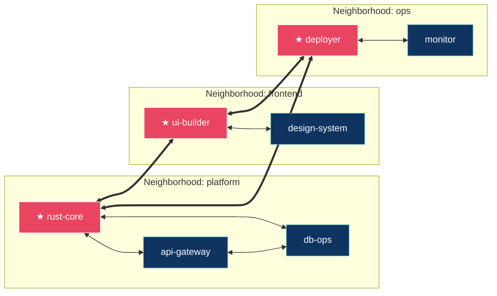
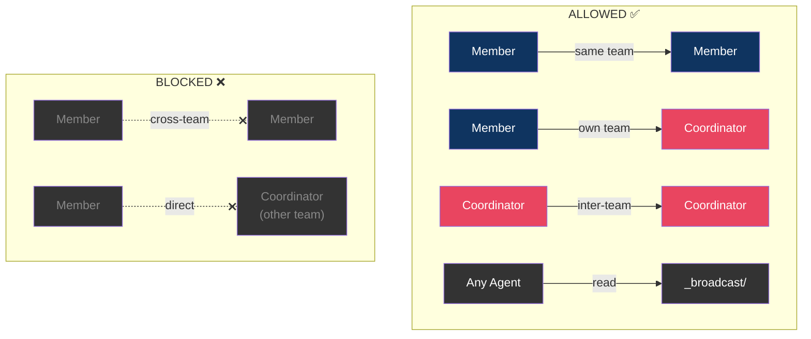
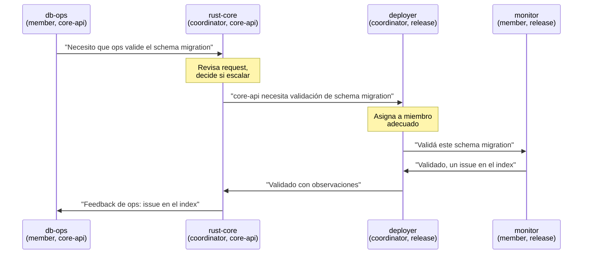
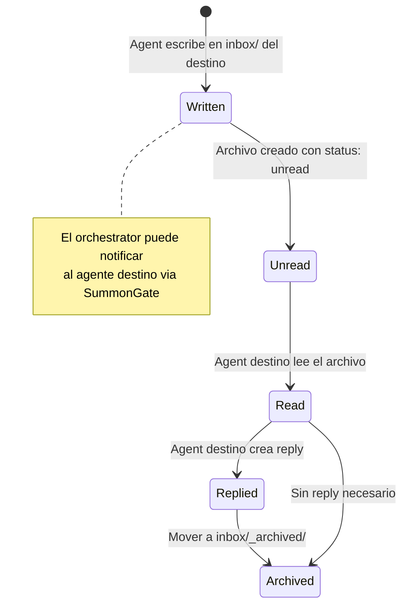
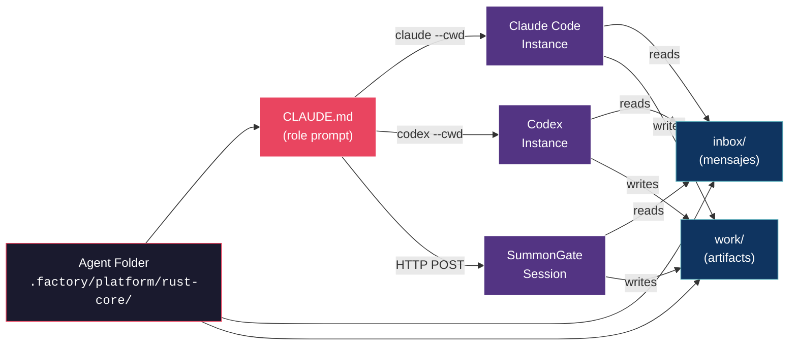
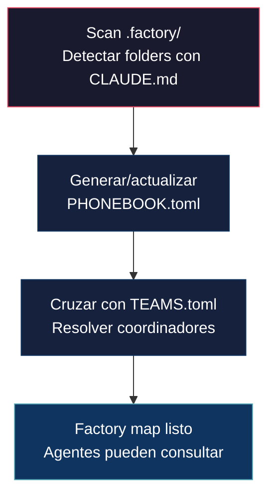
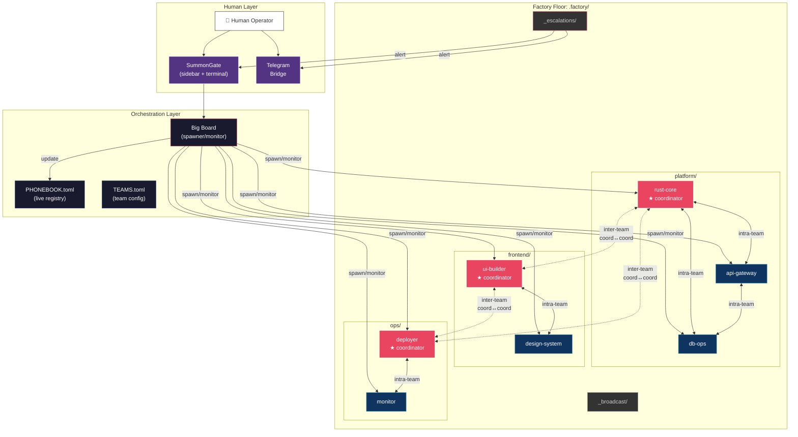

# Dark Factory — Agent Architecture via Files & Folders

> **Status**: Draft
> **Branch**: `feature/agents-communication`
> **Date**: 2026-03-23

---

## 1. Qué es una Dark Factory

Una fábrica "lights-out": opera sin presencia humana constante. Entidades autónomas (agentes) ejecutan, se coordinan, y escalan solo cuando es necesario.

| Concepto Industrial | Equivalente en Agents |
|---|---|
| Celda de trabajo | Agent folder con su `CLAUDE.md` |
| Piso / Zona de fábrica | Neighborhood (parent folder) |
| Línea de producción | Team (grupo funcional) |
| Supervisor de celda | Coordinator (1 per team) |
| Conveyor / señal | Inbox/outbox (archivos `.md`) |
| Tarjeta de rol | `CLAUDE.md` (identidad del agente) |
| Panel de control | SummonGate (visualización humana) |
| Orden de trabajo | Task file o message |

---

## 2. La Regla Fundamental

**1 Folder = 1 Agent = 1 `CLAUDE.md`**

- Un agente **existe** porque tiene un `CLAUDE.md` en su folder.
- Ningún subdirectorio dentro de ese folder puede tener otro `CLAUDE.md`.
- Esto es inviolable — da identidad única y scope limpio.

El `CLAUDE.md` **es** el agente. No es configuración del agente — es el agente mismo. Cuando Claude o Codex abren ese directorio, se convierten en ese agente.

---

## 3. Jerarquía de Conceptos



**Clave**: Un **Team** NO es un folder. Es una agrupación lógica que **cruza** neighborhoods.

- El **neighborhood** es proximidad física (folder structure).
- El **team** es proximidad funcional (definido en config).
- Un agente puede pertenecer a múltiples teams.

---

## 4. Estructura de Carpetas

```
.factory/                              # Factory root
├── FACTORY.md                        # Reglas globales, políticas, constraints
├── TEAMS.toml                        # Definición de teams y coordinadores
├── PHONEBOOK.toml                    # Registry: quién existe, dónde, status
├── _broadcast/                       # Mensajes factory-wide
│   └── ...
├── _escalations/                     # Pedidos de intervención humana
│   └── ...
│
├── platform/                         # ── Neighborhood ──────────────
│   ├── rust-core/                   # Agent folder
│   │   ├── CLAUDE.md                # ★ THE agent identity
│   │   ├── inbox/                   # Mensajes recibidos
│   │   │   ├── msg_20260323_143022_from_api-gateway.md
│   │   │   └── msg_20260323_150100_from_deployer.md
│   │   └── work/                    # Artifacts del agente
│   │
│   ├── api-gateway/                 # Agent folder
│   │   ├── CLAUDE.md
│   │   ├── inbox/
│   │   └── work/
│   │
│   └── db-ops/                      # Agent folder
│       ├── CLAUDE.md
│       ├── inbox/
│       └── work/
│
├── frontend/                         # ── Neighborhood ──────────────
│   ├── ui-builder/
│   │   ├── CLAUDE.md
│   │   ├── inbox/
│   │   └── work/
│   │
│   └── design-system/
│       ├── CLAUDE.md
│       ├── inbox/
│       └── work/
│
└── ops/                              # ── Neighborhood ──────────────
    ├── deployer/
    │   ├── CLAUDE.md
    │   ├── inbox/
    │   └── work/
    │
    └── monitor/
        ├── CLAUDE.md
        ├── inbox/
        └── work/
```

---

## 5. Teams & Coordinadores

### 5.1 Definición en `TEAMS.toml`

```toml
[[team]]
name = "core-api"
coordinator = "platform/rust-core"
members = [
  "platform/rust-core",
  "platform/api-gateway",
  "platform/db-ops",
]

[[team]]
name = "user-experience"
coordinator = "frontend/ui-builder"
members = [
  "frontend/ui-builder",
  "frontend/design-system",
]

[[team]]
name = "release"
coordinator = "ops/deployer"
members = [
  "ops/deployer",
  "ops/monitor",
  "platform/rust-core",         # Participa en 2 teams
]
```

### 5.2 Diagrama de Teams cruzando Neighborhoods



- **★ Rojo** = Coordinador
- **Azul** = Miembro
- **Línea simple `<-->`** = comunicación intra-team
- **Línea doble `<==>`** = comunicación inter-team (coordinator ↔ coordinator)

---

## 6. Reglas de Comunicación

### 6.1 Matriz de Permisos



### 6.2 Flujo inter-team

Cuando un miembro necesita algo de otro team, el mensaje pasa por los coordinadores:



---

## 7. Comunicación via Files

### 7.1 Formato de Mensaje

Cada mensaje es un archivo `.md` en el `inbox/` del destinatario:

```markdown
---
id: "msg_20260323_143022"
from: "platform/rust-core"
to: "platform/api-gateway"
team: "core-api"
timestamp: "2026-03-23T14:30:22Z"
priority: "normal"
status: "unread"
reply_to: ""
---

Necesito que expongas el endpoint `/health` con el schema
que dejé en mi `work/health-schema.json`.

Cuando termines, dejame un reply.
```

### 7.2 Por qué files y no HTTP/stdin

| Aspecto | File-based | HTTP/in-memory |
|---|---|---|
| Legible por humanos | `ls inbox/` | Necesita UI o API call |
| Versionable | git track nativo | Requiere serialización extra |
| Persistente | Sobrevive crashes | Se pierde en memoria |
| Agnóstico | Claude, Codex, cualquier LLM | Requiere SDK/client específico |
| Observable | File watcher nativo del OS | Requiere polling endpoint |
| Debuggeable | `cat inbox/msg_001.md` | Logs o inspect tools |

**File-based es la fuente de verdad.** HTTP/SummonGate es el acelerador y notificador — no reemplaza, complementa.

### 7.3 Ciclo de vida de un mensaje



---

## 8. Instanciación de Agentes

El punto más elegante: **instanciar un agente = abrir un proceso en su carpeta**.

### 8.1 Con Claude Code

```bash
# El CLAUDE.md en el cwd SE CONVIERTE en el role prompt automáticamente
claude --cwd .factory/platform/rust-core
```

### 8.2 Con Codex

```bash
codex --cwd .factory/platform/rust-core
```

### 8.3 Con SummonGate (HTTP API)

```json
{
  "shell": "claude.cmd",
  "shellArgs": [],
  "cwd": "C:/project/.factory/platform/rust-core",
  "sessionName": "rust-core@core-api",
  "env": {
    "AC_AGENT_ID": "platform/rust-core",
    "AC_TEAM": "core-api",
    "AC_FACTORY": "C:/project/.factory"
  }
}
```

### 8.4 Diagrama de instanciación



**No hay "configuración de agente" separada del agente.** El folder ES el agente. El `CLAUDE.md` ES su identidad. Abrir un proceso ahí ES instanciarlo.

---

## 9. PHONEBOOK.toml — Registry en tiempo real

Auto-generado por el orchestrator (SummonGate / big-board). Los agentes lo leen para saber quién está online.

```toml
[[agent]]
path = "platform/rust-core"
neighborhood = "platform"
status = "online"                   # online | offline | busy | idle
session_id = "abc-123"              # SummonGate session ID
teams = ["core-api", "release"]
is_coordinator_of = ["core-api"]
pid = 12345
since = "2026-03-23T14:00:00Z"

[[agent]]
path = "frontend/ui-builder"
neighborhood = "frontend"
status = "idle"
session_id = "def-456"
teams = ["user-experience"]
is_coordinator_of = ["user-experience"]
pid = 12346
since = "2026-03-23T14:02:00Z"

[[agent]]
path = "platform/db-ops"
neighborhood = "platform"
status = "offline"
session_id = ""
teams = ["core-api"]
is_coordinator_of = []
pid = 0
since = ""
```

---

## 10. Funcionalidades para Agilidad

### 10.1 Discovery



- Scan de `.factory/` detecta todos los folders con `CLAUDE.md`
- El agente puede hacer `cat PHONEBOOK.toml` para saber quién existe

### 10.2 Inbox Polling

- El agente revisa `inbox/` al inicio y periódicamente
- Puede ser un hook en su `CLAUDE.md`: *"Antes de cada tarea, revisá tu inbox"*
- El orchestrator puede inyectar un aviso via PTY write

### 10.3 Send Message

- El agente escribe un `.md` en el `inbox/` del destinatario
- El orchestrator valida que el sender tiene permiso (same team, o coordinator→coordinator)

### 10.4 Handoff

- Un agente deja un artifact en `work/` y envía un mensaje referenciando ese path
- El receptor puede leer el archivo directamente (están en el mismo repo)

### 10.5 Broadcast

- `_broadcast/` folder con mensajes para todos los agentes
- `FACTORY.md` puede tener una sección `## Announcements`

### 10.6 Escalation

- Si un agente no puede resolver algo, escribe en `_escalations/`
- SummonGate detecta esto y notifica al humano (Telegram, UI, etc.)

---

## 11. Vista Completa del Sistema



---

## 12. Estado Actual vs Requerido

| Concepto | Status actual | Qué falta |
|---|---|---|
| Agent identity (`CLAUDE.md`) | Patrón documentado en README | Crear `.factory/` con agentes reales |
| Neighborhoods (folders) | No implementado | Definir estructura de neighborhoods |
| Teams (`TEAMS.toml`) | No implementado | Crear spec + parser |
| Coordinator role | No implementado | Lógica de routing en orchestrator |
| Inbox/messaging (files) | Diseñado como HTTP en `PLAN_phone_call` | Adaptar a file-based como fuente de verdad |
| Discovery (`PHONEBOOK`) | Parcial en `phone_list_agents` | File-based auto-scan |
| SummonGate como panel | Funcionando | Agregar vista de factory/teams |
| Instantiation via cwd | Funcional (sessions con cwd) | Agregar env vars `AC_AGENT_ID`, etc. |
| Telegram bridge | Implementado | Conectar con `_escalations/` |
| HTTP API | Planificado en `PLAN_summongate` | Implementar |
| Broadcast | No implementado | Crear `_broadcast/` convention |
| Escalation | No implementado | Crear `_escalations/` + watchers |

---

## 13. Principios de Diseño

1. **Files over APIs**: El filesystem es la fuente de verdad. HTTP acelera, no reemplaza.
2. **Folder = Identity**: Un agente existe porque su folder con `CLAUDE.md` existe. No hay otro registro.
3. **Teams cross neighborhoods**: La estructura física (folders) y lógica (teams) son ortogonales a propósito.
4. **Coordinator bottleneck by design**: La comunicación inter-team pasa por coordinadores. Esto evita caos y crea puntos de control.
5. **Human-observable**: Cualquier humano puede entender el estado de la factory haciendo `ls` y `cat`. No se necesita UI para debugging.
6. **Tool-agnostic instantiation**: El mismo folder funciona con Claude, Codex, o cualquier LLM futuro. El `CLAUDE.md` es el contrato universal.
7. **Git-native**: Toda la estructura, comunicación, y organización es versionable y diffable.
