# Agents Commander: Architecture Map

> Generated from codebase analysis, kept current against the `main` branch (0.20.x). For developers exploring the codebase or contributing changes. Maps the backend, frontend, IPC, PTY, and container layers.

---

## 1. High-Level Architecture

```mermaid
graph TB
    subgraph "Frontend (SolidJS + TypeScript, one main.tsx router)"
        MAIN["main.tsx<br/>Routes on ?window= param"]
        MAIN -->|"default"| SB["Main window<br/>Sidebar + Terminal panes"]
        MAIN -->|"detached"| DT["Detached Terminal<br/>(locked to one session)"]
        MAIN -->|"?window=guide"| GU["Guide window"]
        MAIN -->|"?window=resource-monitor"| RM["Resource Monitor window"]
        MAIN -->|"?window=watchers"| WA["Watchers window"]
        MAIN -->|"?window=screenshot-overlay"| SO["Screenshot overlay"]
        MAIN -->|"?window=spec-board"| SP["Spec Board window"]
        MAIN -->|"not Tauri"| BR["Browser build"]
    end

    subgraph "Shared Layer"
        IPC["shared/ipc.ts<br/>API wrappers + event listeners"]
        TRANSPORT["shared/transport.ts<br/>Tauri vs WebSocket transport"]
        TYPES["shared/types.ts<br/>Interfaces + SessionSelection union"]
        SELDEC["shared/session-selection.ts<br/>Selection decoder"]
        VOICE["shared/voice-recorder.ts<br/>Mic + Gemini"]
        SETTINGS_STORE["stores/settings.ts<br/>Global settings"]
        SHORTCUTS["shortcuts.ts<br/>Keyboard bindings"]
    end

    subgraph "Rust Backend (Tauri 2.x + tokio)"
        LIB["lib.rs<br/>App bootstrap + run()"]
        CMD["commands/<br/>IPC handlers"]
        SESS["session/<br/>SessionManager + selection"]
        PTY["pty/<br/>PtyManager, local + container backends"]
        TG["telegram/<br/>Bridge + Claude/Codex/Gemini watchers"]
        PH["phone/<br/>Mailbox, inter-agent messaging"]
        CFG["config/<br/>Settings, teams, projects, seeds"]
        LOOPS["loops/<br/>Project Loops scheduler"]
        API["api/<br/>Control-plane API server"]
        RSC["resource_monitor/<br/>Process watchdog"]
        SCR["screenshot/<br/>Capture"]
        VCE["voice/<br/>Transcription"]
        WEB["web/<br/>Embedded web/WS server"]
    end

    subgraph "External"
        SHELL["Shell / Agent Process<br/>(PowerShell, Claude, Codex, Pi...)"]
        DOCKER["Docker / Podman<br/>container transport"]
        TGAPI["Telegram Bot API"]
        GEMINI["Google Gemini API"]
        APICLIENT["Control-plane API clients<br/>(containers, scripts)"]
        FS["Filesystem<br/>per-instance config + project .ac/"]
    end

    SB <-->|"invoke() / events"| CMD
    DT <-->|"invoke() / events"| CMD
    GU <-->|"invoke() / events"| CMD

    CMD --> SESS
    CMD --> PTY
    CMD --> TG
    CMD --> PH
    CMD --> CFG

    PTY <-->|"ConPTY / pipes"| SHELL
    PTY <-->|"Docker API"| DOCKER
    TG <-->|"HTTP"| TGAPI
    VOICE -->|"HTTP"| GEMINI
    API <-->|"HTTP"| APICLIENT
    CFG <-->|"JSON/TOML"| FS
    PH <-->|"JSON files"| FS

    style SB fill:#16213e,stroke:#0f3460,color:#fff
    style DT fill:#16213e,stroke:#53a8b6,color:#fff
    style CMD fill:#0f3460,stroke:#53a8b6,color:#fff
    style SHELL fill:#333,stroke:#888,color:#ccc
    style DOCKER fill:#333,stroke:#888,color:#ccc
    style TGAPI fill:#333,stroke:#0088cc,color:#ccc
    style GEMINI fill:#333,stroke:#d97706,color:#ccc
    style FS fill:#333,stroke:#888,color:#ccc
```

---

## 2. Rust Backend Modules

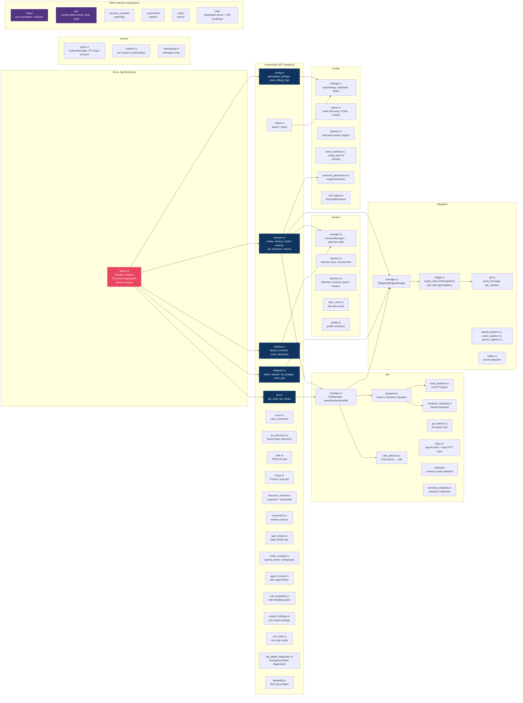

---

## 3. Frontend Components

### 3.1 Main Window (sidebar + terminal)

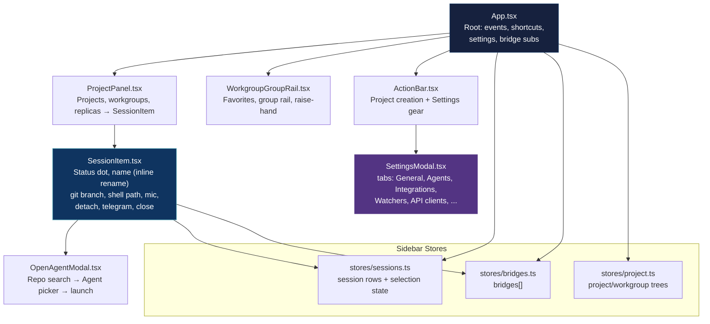

### 3.2 Terminal Pane

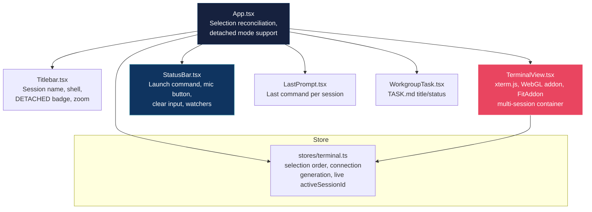

### 3.3 Shared Layer

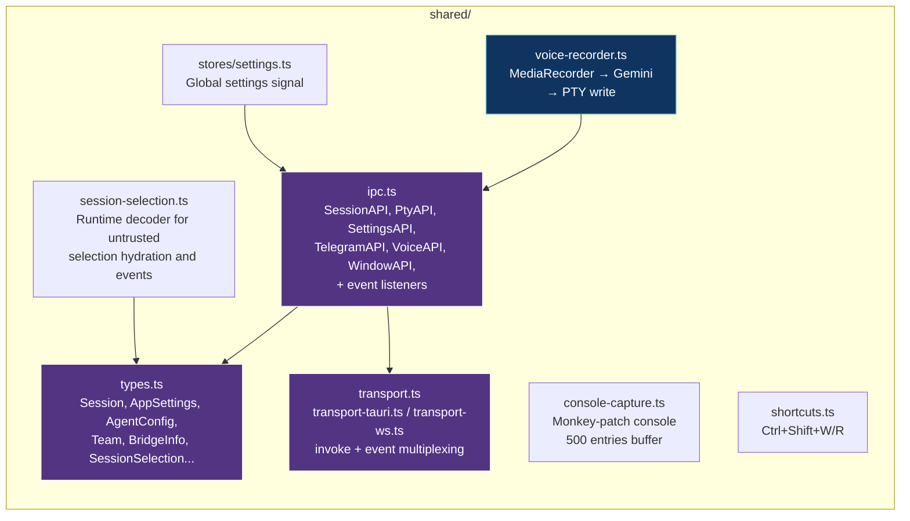

---

## 4. IPC Contract: All Commands

Rust handlers live in `src-tauri/src/commands/`; the frontend invokes them through `shared/ipc.ts`, which routes over a Tauri or WebSocket transport.

| Frontend API area | Rust handler | Examples |
|---|---|---|
| SessionAPI | `commands/session.rs` | `create_session`, `destroy_session`, `switch_session`, `rename_session`, `list_sessions`, `get_active_session` (selection hydration) |
| PtyAPI | `commands/pty.rs` | `pty_write`, `pty_resize` |
| SettingsAPI | `commands/config.rs` | `get_settings`, `update_settings`, `save_debug_logs` |
| ReposAPI | `commands/repos.rs` | `search_repos` |
| TelegramAPI | `commands/telegram.rs` | `attach_telegram`, `detach_telegram`, `list_bridges`, `send_test` |
| WindowAPI | `commands/window.rs` | `detach_terminal`, `close_detached_terminal` |
| VoiceAPI | `commands/voice.rs` | `voice_transcribe` |
| DiscoveryAPI | `commands/ac_discovery.rs` | branch/repo discovery events |
| TaskAPI | `commands/task.rs` | `TASK.md` read/update |
| LoopAPI | `commands/loops.rs` | Project Loop CRUD + state |
| ResourceMonitorAPI | `commands/resource_monitor.rs` | process snapshot, thresholds |
| ScreenshotAPI | `commands/screenshot.rs` | window capture |
| SpecBoardAPI | `commands/spec_board.rs` | spec board CRUD |
| EntityAPI | `commands/entity_creation.rs`, `commands/agent_creator.rs` | agents, teams, workgroups |
| RoleTemplatesAPI | `commands/role_templates.rs` | role-template picker |
| ProjectSettingsAPI | `commands/project_settings.rs` | per-project settings |
| NonStopAPI | `commands/non_stop.rs` | non-stop mode |
| TestabilityAPI | `commands/testability.rs` | test-only bridges and resets |

---

## 5. Events: Backend to Frontend

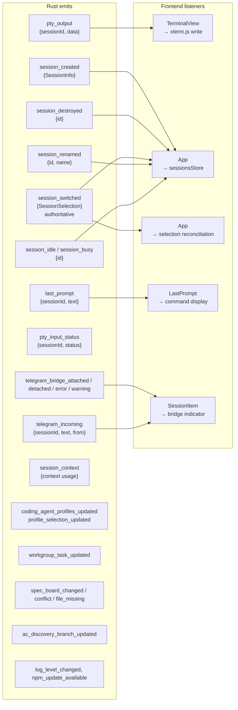

### 5.1 Authoritative session selection contract

`session_switched` is the only authoritative selection event for the central pane. Native Tauri windows and WebSocket clients receive the same stored payload. The `get_active_session` command returns that same payload for hydration, despite retaining its older command name.

The complete Rust and TypeScript wire contract is:

```ts
export type SessionSelectionMode = "none" | "live" | "dormant";

export type SessionSelectionCause =
  | { source: "initialHydration"; userInitiated: false; mode: "none" }
  | { source: "sessionCreated"; userInitiated: boolean; mode: "live" }
  | { source: "userSwitch"; userInitiated: true; mode: "live" | "dormant" }
  | { source: "manualClose"; userInitiated: true; mode: "live" | "none" }
  | { source: "autoClose"; userInitiated: false; mode: "none" }
  | { source: "restart"; userInitiated: boolean; mode: "live" | "none" }
  | { source: "restore"; userInitiated: false; mode: "live" | "dormant" | "none" }
  | { source: "detach"; userInitiated: true; mode: "live" | "none" }
  | { source: "attach"; userInitiated: true; mode: "live" | "dormant" }
  | { source: "spawnRollback"; userInitiated: false; mode: "none" }
  | { source: "resourceMonitor"; userInitiated: boolean; mode: "none" }
  | { source: "backgroundCleanup"; userInitiated: false; mode: "none" }
  | { source: "livenessReconcile"; userInitiated: false; mode: "dormant" | "none" };

export type SessionSelectionSource = SessionSelectionCause["source"];

interface SessionSelectionOrder {
  epoch: string;
  revision: number;
}

type SessionSelectionBase = SessionSelectionOrder & SessionSelectionCause;

export type SessionSelection =
  | (SessionSelectionBase & {
      mode: "none";
      id: null;
      status: null;
      hasPty: false;
      detached: false;
      displayable: false;
    })
  | (SessionSelectionBase & {
      mode: "live";
      id: string;
      status: "active";
      hasPty: true;
      detached: false;
      displayable: true;
    })
  | (SessionSelectionBase & {
      mode: "dormant";
      id: string;
      status: { exited: number };
      hasPty: boolean;
      detached: false;
      displayable: false;
    });
```

The source contract is exact:

| `source` | Allowed modes | Allowed `userInitiated` |
|---|---|---|
| `initialHydration` | `none` at revision 0 only | `false` |
| `sessionCreated` | `live` | Trusted create intent |
| `userSwitch` | `live`, `dormant` | `true` |
| `manualClose` | `live`, `none` | `true` |
| `autoClose` | `none` | `false` |
| `restart` | `live`, `none` | Trusted restart intent |
| `restore` | `live`, `dormant`, `none` | `false` |
| `detach` | `live`, `none` | `true` |
| `attach` | `live`, `dormant` | `true` |
| `spawnRollback` | `none` | `false` |
| `resourceMonitor` | `none` | `true` for a user kill; `false` for a watchdog kill; app shutdown does not emit |
| `backgroundCleanup` | `none` | `false` |
| `livenessReconcile` | `dormant`, `none` | `false` |

All ten fields are required. `epoch` and every non-null `id` are canonical UUID strings, `revision` is a nonnegative safe integer, and an exited status contains a signed 32-bit code. `live` is the only displayable mode and the only mode that may carry status `"active"`. `dormant` preserves the selected record's exit code and reports its actual PTY snapshot, normally `false`, for sidebar continuity and wake guidance. It cannot route terminal input, resize, snapshots, voice, or task actions. `none` clears the central selection. Source, mode, and `userInitiated` must match the table and union above.

The manager creates one nonempty UUID `epoch` with its initial state and owns it for the backend process lifetime. It also owns the process-local `revision`. Each material selection commit increments the revision exactly once; a no-op does not increment or emit. A restarted backend creates a new epoch and a new revision domain. Commands, Tauri event delivery, and WebSocket delivery serialize this stored state but never create or advance an epoch or revision.

### 5.2 Hydration, reconnect, and stale data

The frontend calls `SessionAPI.getSelection()`, which invokes `get_active_session` as `unknown` and passes the result through `decodeSessionSelection`. `onSessionSwitched` uses the same decoder before invoking a consumer. The decoder constructs a normalized object and rejects malformed keys, values, and source-mode combinations before they can mutate a store.

Terminal and sidebar consumers register the selection listener before hydration. WebSocket consumers also track a local connection generation. They apply these ordering rules:

1. Check the captured connection generation before the epoch or revision. A disconnect immediately suspends live routing and display state.
2. Within one epoch, accept only a strictly newer revision during normal reconciliation.
3. Accept any revision from a new, nonretired epoch, and retire the previous epoch. Never accept a retired epoch again.
4. Allow an equal epoch and revision only once for the exact current-generation reconnect hydration that is still awaited. A newer event cancels that permission.
5. Reserve an accepted generation, epoch, revision, mode, and ID before awaiting session metadata. A late hydration or list result cannot overwrite a newer selection.

An exact `selectionCoordinatorBusy` hydration failure schedules one current-generation capped-backoff retry. A selection event, disconnect, replacement generation, or component disposal cancels that retry. Other malformed or failed hydration leaves the consumer in its safe neutral state.

### 5.3 `session_destroyed` does not select

`session_destroyed` reports lifecycle disposal only. Consumers use it to dispose the matching xterm cache and close a matching locked detached window. If its ID matches the writable central binding, the terminal also safety-suspends that binding immediately because the destroy event arrives before the final selection event.

The destroy handler never calls selection hydration, derives a fallback, or chooses a replacement. A later authoritative `session_switched` payload or reconnect hydration alone decides whether the central pane becomes `none`, `live`, or `dormant`.

---

## 6. Data Flows

### 6.1 Session Lifecycle

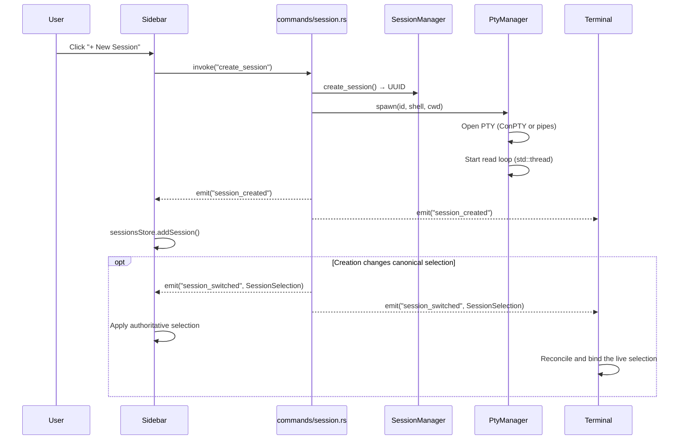

### 6.2 Terminal I/O

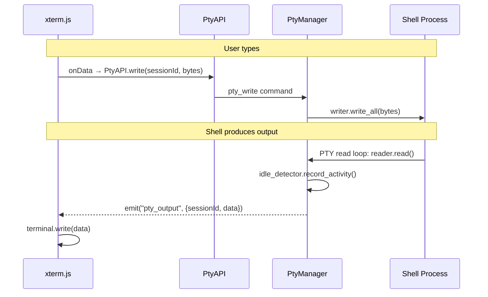

### 6.3 Telegram Bridge Pipeline

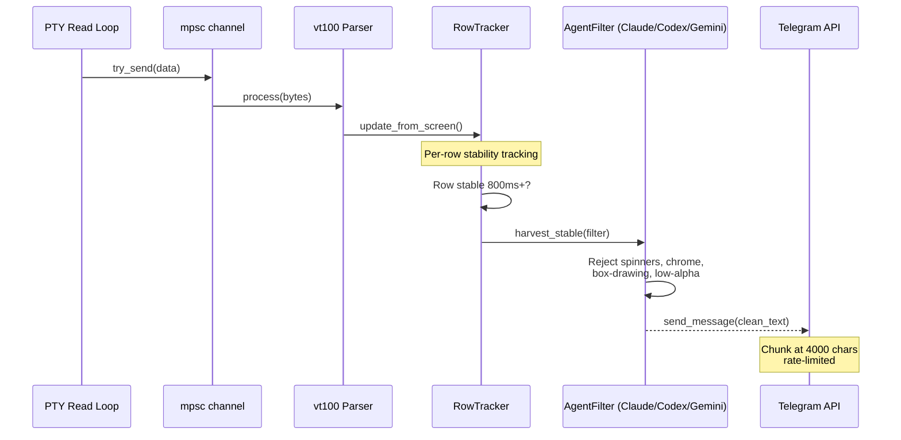

Claude, Codex, and Gemini each have a dedicated watcher (`telegram/claude_watcher.rs`, `codex_watcher.rs`, `gemini_watcher.rs`) that filters screen rows for that agent's terminal chrome.

### 6.4 Voice-to-Text

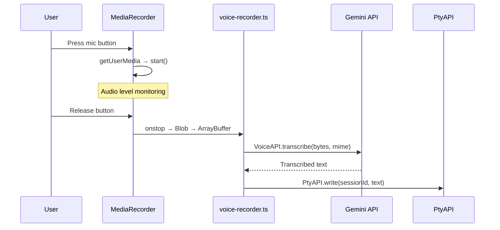

---

## 7. State Management

### 7.1 Rust Managed State

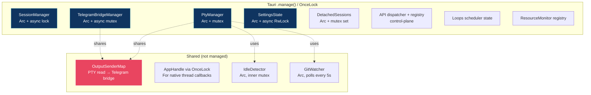

### 7.2 Frontend State

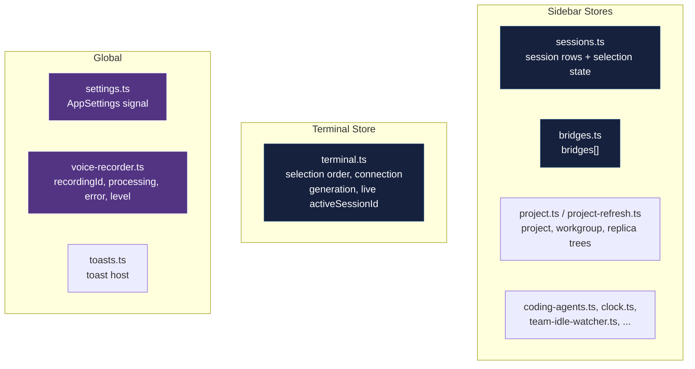

---

## 8. Persistence: Files on Disk

The config directory is **per instance**: `<binary folder>/.<binary stem>/`, next to the executable (portable), with a legacy `$HOME` fallback when `current_exe()` is unavailable. Example: `C:\tools\agentscommander.exe` → `C:\tools\.agentscommander\`. A differently named binary gets its own isolated config dir. See [Directory layout](directory-layout.md) for the full on-disk contract.

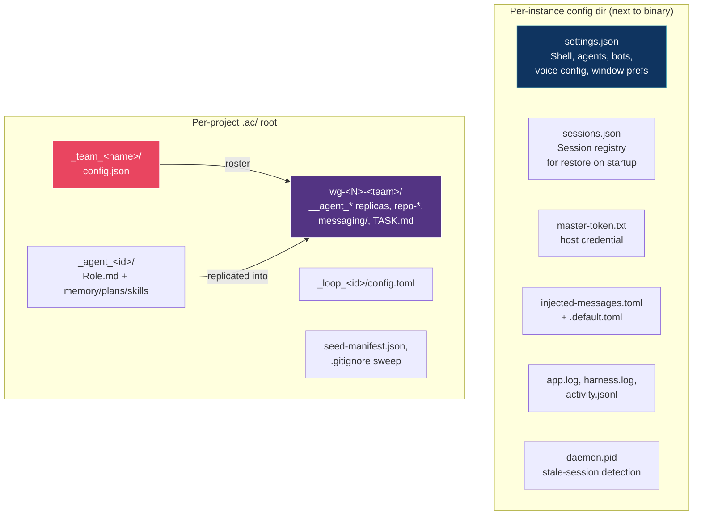

Inter-agent messaging is file-based: senders write Markdown into `<workgroup>/messaging/` and the daemon mailbox delivers it to the recipient's session PTY.

---

## 9. Threading Model

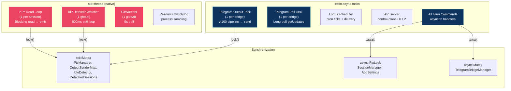

---

## 10. File Index

### Rust Backend (`src-tauri/src/`)

| File | Purpose |
|------|---------|
| `main.rs` | Thin shim → `lib::run()` |
| `lib.rs` | App bootstrap, state init, window creation, session restore, command registration |
| `errors.rs` | `AppError` enum (thiserror) |
| `path_identity.rs`, `path_utils.rs` | Path canonicalization, identity helpers |
| `logging.rs` | Logger setup, live log-level control |
| `shutdown.rs` | Ordered daemon shutdown |
| `update_check.rs` | npm publish version check |
| `session/session.rs` | `Session`, `SessionInfo`, `SessionStatus` structs |
| `session/manager.rs` | `SessionManager`: records, stable order, pending creates, canonical selection state |
| `session/selection.rs` | Selection contract, coordinator, eligibility policy, process epoch, revision, publication |
| `session/profile.rs` | Coding-agent profile resolution per session |
| `session/auto_close.rs` | Idle auto-close clock |
| `session/context_alerts.rs`, `session/warnings.rs` | Context alerts, session warnings |
| `session/purge_guard.rs` | `purge-wg` busy gate |
| `pty/manager.rs` | `PtyManager`: spawn, read loop, write, resize, kill |
| `pty/backend.rs` | Local vs container transport selection |
| `pty/local_backend.rs` | ConPTY/pipes backend |
| `pty/container_backend.rs` | Docker container transport |
| `pty/container_runtime.rs`, `docker_runtime.rs` | Container runtime discovery |
| `pty/container_credentials.rs`, `container_tokens.rs`, `container_paths.rs`, `container_repos.rs` | Container credential/token/path/repo plumbing |
| `pty/idle_detector.rs` | 2.5s silence detection (default), idle/busy events |
| `pty/git_watcher.rs` | 5s branch polling via `git rev-parse` |
| `pty/inject.rs` | Logical clear and exact PTY input injection |
| `pty/job.rs`, `pty/spawn_diagnostics.rs` | Spawn orchestration and diagnostics |
| `pty/output.rs` | PTY output dispatch |
| `pty/context_scrape/` | Context scraper engine |
| `pty/watchers/` | Context-scrape watchers (#1171) |
| `pty/terminal_snapshot/` | Terminal snapshot rendering |
| `telegram/types.rs` | `TelegramBotConfig`, `BridgeInfo`, `BridgeStatus` |
| `telegram/api.rs` | `send_message()`, `get_updates()` |
| `telegram/manager.rs` | `TelegramBridgeManager`, `OutputSenderMap` |
| `telegram/bridge.rs` | vt100 pipeline, `RowTracker`, agent filters, output/poll tasks |
| `telegram/redact.rs` | Secret redaction for bridge output |
| `telegram/claude_watcher.rs`, `codex_watcher.rs`, `gemini_watcher.rs` | Per-agent screen watchers |
| `telegram/jsonl_kernel.rs` | JSONL-based watcher kernel |
| `phone/types.rs` | `OutboxMessage`, PTY-input protocol types |
| `phone/mailbox.rs` | Per-session token authorization, action dispatch |
| `phone/messaging.rs` | Message pump and delivery |
| `phone/consumption.rs` | Message consumption tracking |
| `phone/terminal_snapshot.rs` | Snapshot request/response plumbing |
| `config/mod.rs` | `config_dir()`: per-instance next-to-binary resolution |
| `config/settings.rs` | `AppSettings`, `AgentConfig`, load/save JSON |
| `config/teams.rs` | Team discovery, FQNs, routing rules |
| `config/projects.rs` | Dual-path project registry |
| `config/workspace.rs` | Workspace discovery |
| `config/root_agent.rs` | Root Agent layout and identity |
| `config/sessions_persistence.rs` | `PersistedSession`, snapshot/restore |
| `config/coding_agent_profiles.rs` | Profile matrix resolution |
| `config/coding_agents_catalog.rs` | Catalog of coding agents |
| `config/config_seed.rs`, `seed_manifest.rs` | Config-folder seeding |
| `config/seed_manifest.rs` | Seed manifest + project gate |
| `config/agent_memory.rs`, `agent_creation.rs` | Agent matrix layout and creation |
| `config/project_settings.rs`, `config/loops.rs` | Project settings, Loop config |
| `config/injected_messages.rs` | Injected PTY message templates |
| `config/activity_log.rs` | Activity log |
| `config/coordinator_clocks.rs` | Coordinator idle clocks |
| `config/replica_identity.rs` | Replica identity verification |
| `config/session_context.rs` | Session context reading |
| `config/seeded_context_templates.rs` | Context template seeding |
| `config/archive_gate.rs`, `instance_gitignore.rs`, `daemon_pid.rs`, `placeholders.rs`, `profile.rs` | Supporting config |
| `commands/session.rs` | create, destroy, switch, rename, list, selection |
| `commands/pty.rs` | pty_write, pty_resize |
| `commands/config.rs` | get/update_settings, save_debug_logs |
| `commands/telegram.rs` | attach, detach, list_bridges, get_bridge, send_test |
| `commands/window.rs` | detach_terminal, close_detached_terminal |
| `commands/repos.rs` | search_repos |
| `commands/voice.rs` | voice_transcribe (Gemini API) |
| `commands/ac_discovery.rs` | branch/repo discovery |
| `commands/task.rs` | `TASK.md` operations |
| `commands/loops.rs` | Project Loop CRUD |
| `commands/resource_monitor.rs` | resource snapshots + thresholds |
| `commands/screenshot.rs` | window screenshot capture |
| `commands/spec_board.rs` | Spec Board operations |
| `commands/entity_creation.rs`, `agent_creator.rs` | agents/teams/workgroups creation |
| `commands/role_templates.rs` | role-template picker |
| `commands/project_settings.rs` | per-project settings |
| `commands/non_stop.rs` | non-stop mode |
| `commands/wg_delete_diagnostic.rs` | workgroup delete diagnostics |
| `commands/testability.rs` | test-only bridges |
| `cli/` | CLI verbs: send, list-peers, terminal-snapshot, coding-agent, api-client, window-list, window-screenshot, ... |
| `api/` | Control-plane API server: auth, audit, dispatcher, handlers, message store |
| `loops/` | Loop scheduler, delivery, events, non-stop watchdog |
| `resource_monitor/` | Process registry, watchdog, per-window reporting |
| `screenshot/` | Screenshot capture (Windows) |
| `voice/` | Voice transcription tracking |
| `web/` | Embedded web server, WebSocket broadcast, embedded auth |
| `network/` | Network helpers |
| `testability/` | Test-only reset, window info, UI automation verbs |

### Frontend (`src/`)

| File | Purpose |
|------|---------|
| `main.tsx` | Entry, window routing by `?window=` param |
| `shared/types.ts` | TypeScript interfaces and the invariant-bearing `SessionSelection` union |
| `shared/session-selection.ts` | Runtime decoder for untrusted selection hydration and events |
| `shared/ipc.ts` | API wrappers, decoded selection hydration, event listeners |
| `shared/transport.ts` | Transport abstraction (Tauri vs WebSocket) |
| `shared/transport-tauri.ts`, `shared/transport-ws.ts` | Concrete transports |
| `shared/shortcuts.ts` | Global keyboard shortcuts (Ctrl+Shift+W/R) |
| `shared/constants.ts` | Window type constants |
| `shared/voice-recorder.ts` | Mic recording → Gemini → PTY inject |
| `shared/console-capture.ts` | Console monkey-patch, 500 entries buffer |
| `shared/stores/settings.ts` | Global `AppSettings` signal |
| `shared/stores/toasts.ts` | Toast host state |
| `shared/stores/resourceMonitor.ts` | Resource monitor state |
| `shared/screenshot-hotkey.ts`, `shared/zoom.ts`, `shared/window-geometry.ts` | Window helpers |
| `sidebar/App.tsx` | Sidebar root: events, shortcuts, bridge subs |
| `sidebar/stores/sessions.ts` | Session rows plus authoritative selection state |
| `sidebar/stores/bridges.ts` | `bridges[]` reactive store |
| `sidebar/stores/project.ts` | Project/workgroup/replica tree |
| `sidebar/components/ProjectPanel.tsx` | Projects, workgroups and replicas → `SessionItem` |
| `sidebar/components/WorkgroupGroupRail.tsx` | Rail with favorites, groups, raise-hand |
| `sidebar/components/SessionItem.tsx` | Status dot, name, git branch, mic, telegram, detach, close |
| `sidebar/components/ActionBar.tsx` | Project creation + Settings gear |
| `sidebar/components/SettingsModal.tsx` | Settings tabs: General, Agents, Integrations, Watchers, API clients, ... |
| `sidebar/components/OpenAgentModal.tsx` | Repo search → agent picker → launch |
| `sidebar/components/NewTeamModal.tsx`, `EditTeamModal.tsx`, `NewWorkgroupModal.tsx`, `NewEntityAgentModal.tsx` | Entity creation |
| `sidebar/components/NewLoopModal.tsx`, `EditLoopModal.tsx` | Loop CRUD UI |
| `sidebar/components/ArchivedProjectsModal.tsx`, `AutoUnarchiveModal.tsx` | Archive handling |
| `sidebar/components/RestartPromptModal.tsx`, `OnboardingModal.tsx`, `RootAgentBanner.tsx`, `WebServerMenu.tsx` | App chrome |
| `terminal/App.tsx` | Terminal root: authoritative selection reconciliation and detached mode |
| `terminal/stores/terminal.ts` | Ordered selection state, connection generation, binding state, live-only `activeSessionId` |
| `terminal/components/TerminalView.tsx` | xterm.js multi-session container, WebGL, FitAddon |
| `terminal/components/Titlebar.tsx` | Session name, shell, DETACHED badge |
| `terminal/components/StatusBar.tsx` | Launch command, mic button, clear input, watchers |
| `terminal/components/LastPrompt.tsx` | Last command display per session |
| `terminal/components/WorkgroupTask.tsx` | TASK.md title/status |
| `terminal/components/TaskCleanConfirmModal.tsx` | Task clean confirmation |
| `guide/` | Guide window app (hints, tutorial) |
| `resource-monitor/` | Resource Monitor window app |
| `watchers/` | Watchers window app |
| `screenshot-overlay/` | Screenshot selection overlay |
| `spec-board/` | Spec Board window app |
| `browser/` | Non-Tauri browser build |

### Config Files

| File | Purpose |
|------|---------|
| `src-tauri/tauri.conf.json` | Tauri config, app version, window defs, capabilities |
| `src-tauri/Cargo.toml` | Rust dependencies |
| `package.json` | Frontend deps, scripts (`tauri dev`, `kill-dev`) |
| `vite.config.ts` | Vite config, `__APP_VERSION__` injection from tauri.conf.json |
